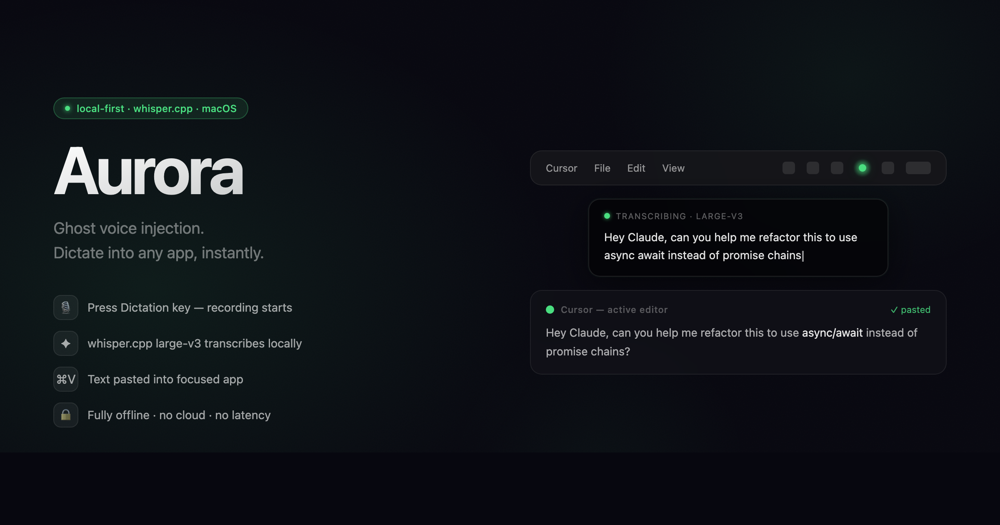

# ✨ Aurora



Ghost voice-injection for macOS. Press Dictation key → mic records → press again → whisper.cpp transcribes → text pastes into the focused app. Works with local whisper (offline) or EC2 via SSH tunnel.

## How it works

```
Press Dictation key
  → green dot breathes (LISTENING) — recording starts
Press again
  → dot spins (PROCESSING) — audio sent to whisper-server
Transcription streaming
  → text panel appears (TRANSCRIBING) — tokens arrive live
Done
  → green flash (READY) — full text pasted into focused app
```

## New machine setup

### 1. Clone and install

```bash
git clone git@github.com:maiixu/aurora
cd aurora
npm install
```

### 2. Karabiner Elements

Install [Karabiner Elements](https://karabiner-elements.pqrs.org/) and use config from dotfiles:

```bash
cp <your-dotfiles>/karabiner/karabiner.json ~/.config/karabiner/karabiner.json
```

The rule maps **Dictation key → `Cmd+Ctrl+Alt+Shift+F13`** (Hyper+F13). Aurora registers this combo via Electron `globalShortcut` — no Input Monitoring permission needed.

### 3. macOS permissions

Grant in **System Settings → Privacy & Security**:

| Permission | Why |
|---|---|
| **Microphone** | Record audio (prompted on first launch) |
| **Accessibility** | Paste text into apps via UI scripting |

No Input Monitoring required (uiohook removed in v0.2.0).

### 4. Backend: Local whisper (recommended)

Aurora defaults to local whisper.cpp for fully offline transcription.

**Build whisper-server:**

```bash
git clone https://github.com/ggerganov/whisper.cpp ~/code/whisper.cpp
cd ~/code/whisper.cpp
cmake -B build -DGGML_METAL=ON -DWHISPER_BUILD_SERVER=ON -DCMAKE_BUILD_TYPE=Release
cmake --build build -j$(sysctl -n hw.ncpu) --target whisper-server
```

**Download models:**

```bash
mkdir -p ~/.aurora/models
cd ~/code/whisper.cpp
./models/download-ggml-model.sh large-v3        # 2.9 GB, best quality
./models/download-ggml-model.sh large-v3-turbo  # 1.5 GB, fast
cp models/ggml-large-v3.bin ~/.aurora/models/
cp models/ggml-large-v3-turbo.bin ~/.aurora/models/
```

Aurora auto-selects the best available model (prefers `large-v3`). Switch anytime from tray → **Local Model**.

### 5. Backend: Remote whisper via SSH (optional)

Aurora can tunnel to any remote machine running `whisper-server` — an EC2 instance, a Mac mini, a home server, anything reachable via SSH. The remote machine offloads inference entirely; useful when you want to save local RAM or use a more powerful box.

```bash
# Generate a dedicated key
ssh-keygen -t ed25519 -f ~/.ssh/aurora_ec2 -C "aurora@mac"
ssh-copy-id -i ~/.ssh/aurora_ec2.pub <user>@<remote-host>

# ~/.ssh/config:
Host mac-ec2          # alias used by Aurora (override with AURORA_SSH_HOST)
  HostName <ip-or-hostname>
  User <user>
  IdentityFile ~/.ssh/aurora_ec2
```

The remote host must run `whisper-server` (whisper.cpp) on port 8080 (override with `AURORA_WHISPER_PORT`). Aurora forwards `localhost:18080 → remote:8080` via SSH tunnel.

```bash
export AURORA_SSH_HOST=mac-mini     # any SSH config alias
export AURORA_WHISPER_PORT=9000     # if whisper-server runs on a different port
```

### 6. Backend config

Aurora's default is **Local only** with `large-v3`. Change in tray → **Backend**:

| Mode | Behaviour |
|---|---|
| **Local only** | whisper-server runs locally; fully offline |
| **EC2 only** | SSH tunnel to remote whisper-server (EC2, Mac mini, any host) |
| **Auto (EC2 → Local)** | tries remote first, falls back to local after 6s |

Config stored in `~/.aurora/config.json`.

### 7. Dictionary

```bash
mkdir -p ~/.aurora
touch ~/.aurora/dictionary.txt
```

Format:

```
Claude, Claude Code, Cursor, Obsidian, TypeScript, Karabiner, macOS

[replace]
cloud code = Claude Code
cloud = Claude
```

- Top section: whisper initial prompt — biases recognition toward these spellings
- `[replace]`: deterministic post-processing substitutions (longer phrases first)
- Loaded fresh on every transcription — edit anytime, no restart needed

### 8. Build and install

```bash
npm run build
# → release/mac-arm64/Aurora.app
```

**First install:**
```bash
cp -r release/mac-arm64/Aurora.app /Applications/
# System Settings → General → Login Items → add Aurora
```

**Update existing install (faster — preserves app bundle signature):**
```bash
npm run update-app
# or
npm run deploy   # build + update-app in one step
```

> ⚠️ Do not `cp -r` over an existing `/Applications/Aurora.app` — this breaks the ad-hoc code signature and causes the menu bar icon to disappear. Use `update-app` for all subsequent updates.

### 9. Development

```bash
npm run dev                    # development mode
AURORA_DEVTOOLS=1 npm run dev  # enable Chrome DevTools on port 9222
```

## Secrets / what's NOT in this repo

| Secret | Location |
|---|---|
| EC2 SSH key | `~/.ssh/aurora_ec2` |
| SSH host config | `~/.ssh/config` |
| Karabiner config | your dotfiles repo |
| Dictionary | `~/.aurora/dictionary.txt` |
| whisper models | `~/.aurora/models/` |

No API keys, no passwords, no tokens are stored in this repo.

## Security notes

- **EC2 Security Group**: only SSH (22) open inbound. Port 8080 must NOT be exposed — Aurora reaches it via tunnel only.
- **SSH key**: use dedicated `aurora_ec2` key, not shared keys.
- **DevTools**: disabled by default. Enable with `AURORA_DEVTOOLS=1`.
- **Paste trust**: Aurora pastes text directly into the focused app. Keep EC2 locked down.
- **Bundle ID**: `com.maixu.aurora` — do not revert to `com.aurora.app` (Gatekeeper cache issue on macOS Sequoia).
